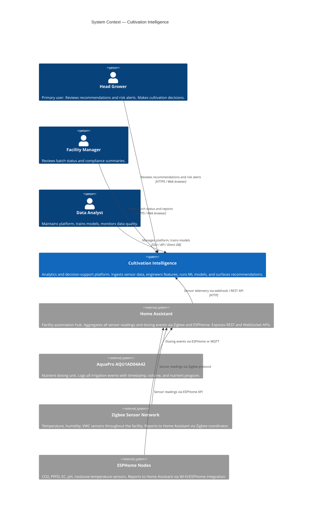
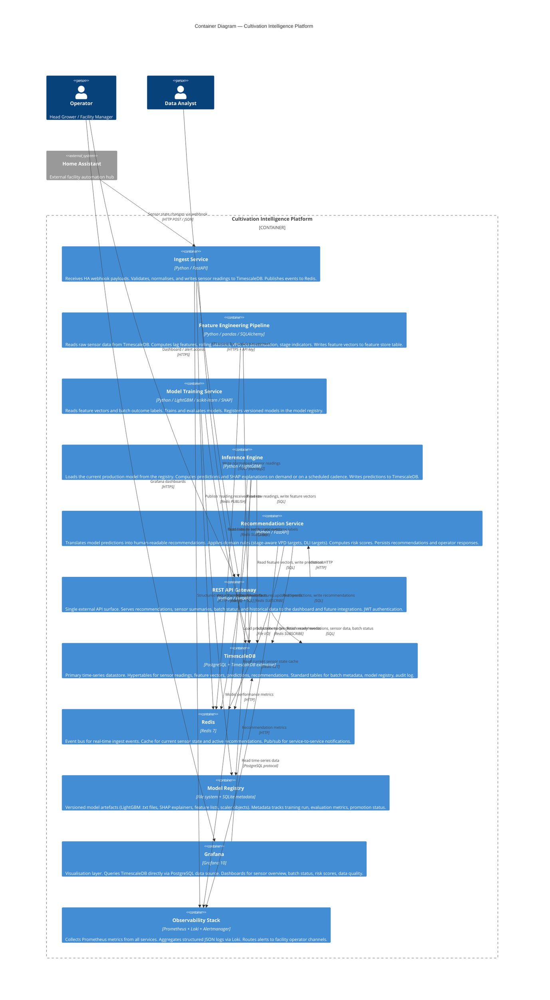
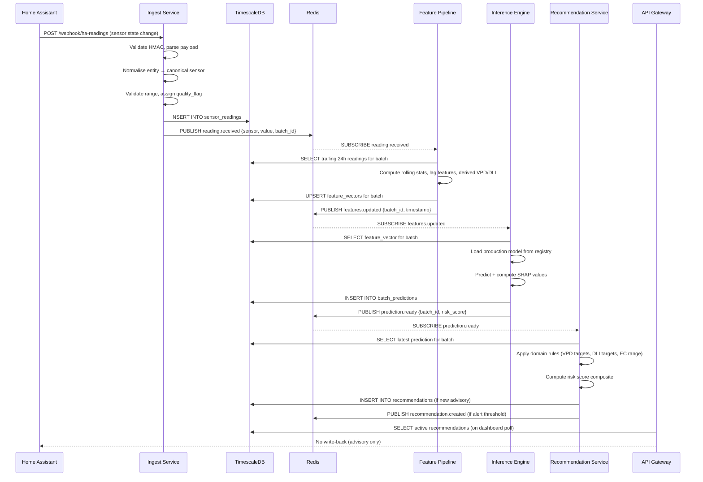
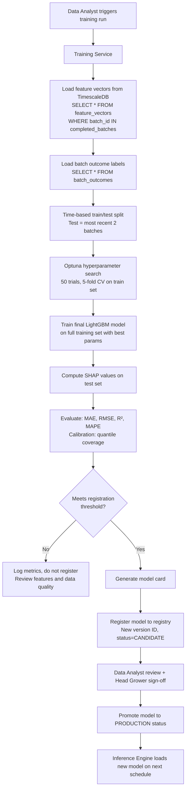

# Architecture

**Cultivation Intelligence — System Architecture**

*Legacy Ag Limited | Internal Technical Document*
*Version: 0.3 | Date: March 2026*

---

## 1. Architecture Philosophy

The Cultivation Intelligence platform is built on four architectural principles that reflect both the operational context of a licensed medicinal cannabis facility and the realities of a small internal engineering team.

**Modular and independently deployable.** Each functional component — ingestion, feature engineering, training, inference, recommendations, monitoring — is a distinct module with a well-defined interface. Modules can be developed, tested, and deployed independently. A failure in the recommendation service does not affect data ingestion. A model training run does not consume resources that would affect the real-time inference path.

**Advisory-first and fail-safe.** The platform reads from the facility's Home Assistant instance; it does not write to it. If the entire CI platform were shut down, facility operations would continue without interruption. The system is purely additive. Any future write-back capability will be implemented as an explicit, separately deployed, separately authorised component with hard safety bounds.

**Observable by default.** Every service emits structured logs (structlog, JSON format). Every pipeline stage records metrics (Prometheus format). Every model prediction is stored with its inputs, outputs, and metadata. The system's internal state should be fully reconstructable from its logs and stored data.

**Incrementally evolvable.** The data model, API contracts, and module interfaces are designed to accommodate the analytical capabilities that are planned for Phase 2 and beyond without requiring breaking changes. Model swaps (e.g., upgrading from LightGBM to TFT for a specific prediction task) should require no changes to downstream consumers of the recommendation API.

---

## 2. System Context (C4 Level 1)



---

## 3. Container Diagram (C4 Level 2)



---

## 4. Component Breakdown

### 4.1 Ingest Service

**Responsibility:** The entry point for all facility data. Receives webhook callbacks from Home Assistant, validates and normalises the payload, persists to TimescaleDB, and publishes an event to Redis for downstream consumers.

**Key functions:**
- `receive_ha_webhook(payload)`: FastAPI route handler. Validates HMAC signature on the HA webhook. Extracts entity ID, state, and attributes.
- `normalise_entity(entity_id, state, attributes)`: Maps HA entity IDs to canonical sensor names using a configuration-driven entity registry. Converts units (e.g., ensures temperature is always in °C, not °F). Validates value ranges against configured sensor bounds.
- `write_reading(canonical_name, value, unit, timestamp, quality_flag)`: Inserts a row into the `sensor_readings` hypertable in TimescaleDB.
- `publish_event(event_type, payload)`: Publishes a JSON event to the appropriate Redis channel.

**Error handling:**
- Invalid HMAC: reject with 401, log at WARNING.
- Unknown entity ID: store with quality_flag = "UNKNOWN_ENTITY", log at INFO. Do not block.
- Value out of configured range: store with quality_flag = "RANGE_EXCEEDANCE", log at WARNING. Publish alert event.
- Database write failure: retry with exponential backoff (max 3 attempts, max 30s delay). If all retries fail, log at ERROR and increment `ingest_write_failures_total` counter.
- HA webhook payload malformed: reject with 422, log at WARNING.

**Dosing event handling:**
The AquaPro unit (AQU1AD04A42) reports dosing events via ESPHome integration in Home Assistant. Dosing events are distinguished from continuous sensor readings by entity ID prefix and are routed to a separate `dosing_events` table with columns: `timestamp`, `batch_id`, `device_serial`, `nutrient_program_id`, `volume_ml`, `ec_target`, `ph_target`.

### 4.2 Feature Engineering Pipeline

**Responsibility:** Transforms raw sensor readings into ML-ready feature vectors at the batch level and at configurable time-step resolution for real-time inference.

**Execution modes:**
1. **Batch mode:** Triggered nightly. Recomputes all features for any batch that has received new data in the past 24 hours.
2. **Streaming mode:** Triggered by Redis `reading.received` events. Recomputes the rolling features for the current batch's latest time window (e.g., trailing 24 hours of features). Publishes `features.updated` event.

**Feature categories:**

| Category | Examples | Implementation |
|---|---|---|
| Instantaneous | Current VPD, current EC, current pH | Derived from latest reading |
| Rolling statistics | VPD mean/std/max over 1h, 6h, 24h, 7d | pandas rolling() with min_periods |
| Lag features | EC lagged by 6h, 12h, 24h, 48h | pandas shift() |
| Cumulative integrals | DLI accumulated today; DLI deficit from stage start | Trapezoidal integration over PPFD |
| Stage-stratified | VPD mean during veg only; pH variance in early flower | Filtered pandas groupby |
| Event-derived | Dosing frequency (events/day); pH adjustment count | Count aggregations on dosing_events |
| Grow stage indicators | One-hot encoded: propagation / veg / early_flower / late_flower | Joined from batch metadata |
| Cross-sensor derived | VPD from T and RH (Formula in theory.md §6.1) | Row-wise computation |

**Grow stage assignment:** Each sensor reading is annotated with the grow stage active at that timestamp by joining against the `batch_stage_schedule` table in the batch metadata registry. If no stage schedule is available for a batch, stage assignment falls back to elapsed-days-from-start heuristics with configurable day thresholds.

### 4.3 Model Training Service

**Responsibility:** Trains, evaluates, and registers machine learning models. Intended to be run manually by the Data Analyst, not on an automatic schedule (model deployment is a human decision in Phase 1).

**Training workflow:**
1. Load feature vectors and batch outcome labels from TimescaleDB.
2. Apply train/validation/test split (time-based: always hold out the most recent N batches as test set to simulate production conditions).
3. Fit LightGBM model with cross-validated hyperparameter optimisation (Optuna).
4. Evaluate against held-out test set: RMSE, MAE, R², MAPE.
5. Compute SHAP values for all test set predictions.
6. Assess calibration (quantile regression models: check empirical coverage of 10/90 percentile intervals).
7. Generate model card (training data range, feature list, evaluation metrics, known limitations).
8. If metrics meet threshold criteria, register model to the model registry with a new version ID.
9. Promotion to production is a separate explicit step (requires Data Analyst decision + Head Grower sign-off).

**Evaluation thresholds for registration (Phase 1 targets):**
- Batch yield index MAE < 8% of mean historical yield
- Calibration: empirical 80% interval coverage between 75% and 90%
- No single feature with SHAP importance > 60% of total (guard against overfitting to a single sensor)

### 4.4 Inference Engine

**Responsibility:** Loads the active production model and produces predictions, with SHAP explanations, for the current state of all active batches.

**Execution modes:**
1. **Scheduled:** Every 15 minutes, recomputes predictions for all active batches using the latest feature vectors.
2. **On-demand:** Via internal API call from the Recommendation Service.
3. **Event-triggered:** On receipt of a `features.updated` Redis event for a high-priority batch (e.g., a batch currently flagged as elevated risk).

**Prediction outputs stored per inference run:**
- `batch_id`
- `model_version`
- `timestamp` (inference time)
- `feature_vector` (JSON: the exact input features used — essential for debugging and audit)
- `prediction_point` (50th percentile)
- `prediction_lower` (10th percentile)
- `prediction_upper` (90th percentile)
- `shap_values` (JSON: feature name → SHAP value mapping)
- `prediction_confidence` (derived from ensemble disagreement or interval width)

### 4.5 Recommendation Service

**Responsibility:** Translates raw model predictions into human-actionable recommendations. Applies domain rules for stage-aware environmental targets. Computes and maintains the batch risk score.

**Recommendation types:**

| Type | Trigger | Example |
|---|---|---|
| ENVIRONMENTAL_ADVISORY | VPD deviates from stage target for > 30 min | "Room 2 VPD is 1.7 kPa against a late-flower target of 1.2–1.5 kPa. Consider increasing dehumidification." |
| NUTRIENT_ADVISORY | EC or pH outside stage-appropriate range | "Batch 2024-11 nutrient EC has been 2.8 mS/cm for 4 hours against a target of 2.0–2.4 mS/cm. Review dosing program." |
| DLI_ADVISORY | DLI accumulation tracking below daily target | "Room 1 DLI today is 28 mol m⁻² d⁻¹ at 14:00 against a 35 mol m⁻² d⁻¹ target. Consider extending photoperiod by 1 hour." |
| BATCH_RISK_ALERT | Batch risk score exceeds 70/100 | "Batch 2024-12 risk score: 74/100. Primary contributors: cumulative VPD stress hours in early flower (SHAP +12), pH variance in week 2 (SHAP +8)." |
| OUTCOME_FORECAST | Scheduled batch outcome prediction update | "Batch 2024-11 yield index forecast: 81% of target (10th–90th percentile: 74%–88%). Based on data through day 42 of flower." |
| DATA_QUALITY_ALERT | Sensor dropout or range exceedance | "VWC sensor Room3-Substrate-A has not reported in 45 minutes. Check device." |

**Risk score computation:**
The batch risk score (0–100) is computed as a weighted combination of:
- Model predicted yield index deviation from target (50% weight)
- Active environmental advisories count and duration (30% weight)
- Data quality (missing data rate, sensor faults) (20% weight)

Risk score thresholds: 0–39 = Normal; 40–69 = Elevated; 70–89 = High; 90–100 = Critical.

**Operator response logging:**
Every recommendation has a lifecycle: `PENDING → ACKNOWLEDGED → (ACCEPTED | OVERRIDDEN | NOT_APPLICABLE)`. Operator responses are stored in the `recommendation_responses` table with operator ID, timestamp, and free-text reasoning.

### 4.6 REST API Gateway

**Responsibility:** Single external-facing HTTP API surface for the dashboard, Grafana, and future integrations.

**Authentication:** API key (Bearer token in Authorization header) for v1. JWT with short-lived tokens planned for v2 when multi-user access control is required.

**Core endpoint groups:**

| Group | Path Prefix | Description |
|---|---|---|
| Recommendations | `/api/v1/recommendations` | List active recommendations; get by ID; post operator response |
| Batch | `/api/v1/batches` | List batches; get batch detail; get batch risk score; get batch timeline |
| Sensor | `/api/v1/sensors` | Current readings; historical time series; data quality report |
| Models | `/api/v1/models` | List registered models; get model card; promote model to production |
| Health | `/health`, `/metrics` | Liveness, readiness, Prometheus metrics |

**Versioning strategy:** URL-based versioning (`/api/v1/`, `/api/v2/`). v1 will be maintained for a minimum of 12 months after v2 is introduced. Breaking changes require a version increment.

### 4.7 Monitoring and Observability

**Structured logging:** All services use `structlog` configured with the `JSONRenderer` processor. Log fields include `service`, `level`, `timestamp` (ISO 8601 UTC), `trace_id` (UUID per request chain), `event`, and context-specific fields. Logs are written to stdout and aggregated by Loki.

**Metrics (Prometheus):**

| Metric | Type | Description |
|---|---|---|
| `ci_ingest_readings_total` | Counter | Total sensor readings ingested, by entity and quality_flag |
| `ci_ingest_write_latency_seconds` | Histogram | Time from webhook receipt to database write |
| `ci_feature_pipeline_duration_seconds` | Histogram | Feature engineering run duration, by mode and batch_id |
| `ci_inference_prediction_latency_seconds` | Histogram | Inference run duration, by model_version |
| `ci_recommendation_generated_total` | Counter | Recommendations generated, by type |
| `ci_recommendation_adopted_total` | Counter | Recommendations accepted by operators |
| `ci_model_prediction_value` | Gauge | Current batch risk score, by batch_id |
| `ci_data_quality_missing_rate` | Gauge | Fraction of expected readings missing, by sensor |

**Alerting rules (Alertmanager):**

| Alert | Condition | Severity | Notification |
|---|---|---|---|
| IngestPipelineDown | No readings ingested in 10 min during operational hours | Critical | Facility operations channel |
| SensorDropout | Specific sensor not reporting for > 30 min | Warning | Data Analyst |
| ModelDriftDetected | Prediction MAE on live data exceeds 1.5× training MAE | Warning | Data Analyst |
| HighRiskBatchAlert | Any batch risk score > 70 | Warning | Head Grower |
| CriticalRiskBatchAlert | Any batch risk score > 90 | Critical | Head Grower + Facility Manager |
| DatabaseStorageHigh | TimescaleDB disk usage > 80% | Warning | Data Analyst |

---

## 5. Data Flow

### 5.1 Real-Time Ingest Path



End-to-end latency target: sensor reading → stored recommendation < 5 minutes.

### 5.2 Model Training Path



### 5.3 Batch Prediction Path (Scheduled)

Every 15 minutes during operational hours, the Inference Engine runs a scheduled prediction sweep:

1. Query `active_batches` from the batch metadata registry.
2. For each batch: load the latest feature vector from `feature_vectors`.
3. Load the `PRODUCTION` model from the registry (cached in memory; reloaded only on version change).
4. Generate predictions (point, 10th percentile, 90th percentile).
5. Compute SHAP values.
6. Write to `batch_predictions` with inference timestamp.
7. Emit Prometheus metric: `ci_model_prediction_value{batch_id=X}`.
8. Publish `prediction.ready` to Redis for the Recommendation Service.

---

## 6. Service Map

| Service | Internal Port | Protocol | Health Check | Notes |
|---|---|---|---|---|
| Ingest Service | 8001 | HTTP | `GET /health` | Exposed to HA via facility LAN |
| Recommendation Service | 8002 | HTTP | `GET /health` | Internal only |
| Inference Engine | 8003 | HTTP | `GET /health` | Internal only |
| Feature Pipeline | — | No HTTP port | Prometheus `/metrics` only | Runs as scheduled process |
| API Gateway | 8000 | HTTPS | `GET /health` | Exposed to facility LAN |
| TimescaleDB | 5432 | PostgreSQL | `pg_isready` | Not exposed outside app subnet |
| Redis | 6379 | Redis protocol | `PING` | Not exposed outside app subnet |
| Grafana | 3000 | HTTP | `GET /api/health` | Exposed to facility LAN |
| Prometheus | 9090 | HTTP | `GET /-/healthy` | Internal only |
| Alertmanager | 9093 | HTTP | `GET /-/healthy` | Internal only |

---

## 7. Deployment Architecture

### 7.1 Docker Compose (Development and Production v1)

All services are containerised and orchestrated with Docker Compose. A single `docker-compose.yml` at the repository root defines the full stack. Environment-specific overrides are applied via `docker-compose.override.yml` (local development) and `docker-compose.prod.yml` (production).

```yaml
# Abbreviated service structure
services:
  ingest:
    build: ./services/ingest
    ports: ["8001:8001"]
    environment:
      - DATABASE_URL=${DATABASE_URL}
      - REDIS_URL=${REDIS_URL}
      - HA_WEBHOOK_SECRET=${HA_WEBHOOK_SECRET}
    depends_on: [timescaledb, redis]
    restart: unless-stopped

  timescaledb:
    image: timescale/timescaledb:latest-pg15
    volumes:
      - tsdb_data:/var/lib/postgresql/data
    ports: ["5432:5432"]  # Not exposed in production
    environment:
      - POSTGRES_DB=cultivation
      - POSTGRES_USER=${DB_USER}
      - POSTGRES_PASSWORD=${DB_PASSWORD}

  redis:
    image: redis:7-alpine
    volumes:
      - redis_data:/data
    command: redis-server --appendonly yes
```

**Environment variables** are managed via a `.env` file (never committed to git) on the production host. A `.env.example` is committed with placeholder values.

### 7.2 Production Hardware

Phase 1 production runs on a single dedicated on-premises server:

- **Recommended spec:** 8-core CPU, 32 GB RAM, 2 TB SSD (NVMe preferred)
- **OS:** Ubuntu 22.04 LTS
- **Docker:** Docker Engine 24+, Docker Compose v2
- **Network:** Connected to facility LAN; no internet dependency for operations

**Storage estimate:** At 1-minute resolution across 12 sensor streams, raw ingestion rate is approximately 17,280 readings/day. At ~100 bytes per row after TimescaleDB compression, this is approximately 600 MB per year of raw data — negligible. Feature vectors, predictions, and model artefacts are comparable in volume. A 2 TB disk provides many years of headroom.

### 7.3 Backup Strategy

- TimescaleDB: nightly `pg_dump` to compressed archive. Retained for 90 days on a separate attached storage volume.
- Model registry: rsync to a secondary location on the facility network after each training run.
- Configuration and code: git repository (internal).

### 7.4 Update Process

1. Pull latest code from git repository.
2. Run `docker compose build` to rebuild changed service images.
3. Run database migrations if schema changes are included (`alembic upgrade head`).
4. Run `docker compose up -d` to roll out new images (Docker Compose handles graceful restart).
5. Monitor health checks and logs for 15 minutes post-deployment.
6. Roll back with `docker compose up -d --no-build` from the previous git commit if issues detected.

---

## 8. Security Architecture

### 8.1 Authentication and Authorisation

**API Gateway:** Bearer token authentication. API keys are issued per role (Head Grower read-only key, Data Analyst read-write key). Keys are rotated quarterly or on personnel change. Token validation is performed by a middleware layer in FastAPI using a constant-time comparison.

**Home Assistant webhook:** All incoming HA webhook payloads are authenticated via HMAC-SHA256 signature. The shared secret is configured in both HA and the Ingest Service via environment variable. Requests with invalid or missing signatures are rejected with 401 before any processing occurs.

**Internal service communication:** Services communicate over the Docker internal network (`ci_internal`). TimescaleDB and Redis are bound to the internal network only and are not reachable from outside the Docker Compose stack.

**Database access:** The application database user has only INSERT, SELECT, and UPDATE permissions on application tables. DROP, CREATE, and ALTER permissions are held by the migration user only, which is used exclusively during planned upgrade procedures.

### 8.2 Secret Management

All secrets (database passwords, HA API token, webhook secrets, API keys) are stored in `.env` files on the production host with `chmod 600` and are never committed to the git repository. The `.env.example` file in the repository contains placeholder values only.

The HA long-lived access token used by the Ingest Service to pull additional data from HA's REST API is stored as `HA_API_TOKEN` environment variable. This token has read-only scope — it is created in HA with entity read permissions only.

### 8.3 Network Isolation

The CI platform is deployed on the facility's operational LAN. The API Gateway and Grafana are accessible from any device on the LAN (controlled by facility Wi-Fi authentication). The internal services (TimescaleDB, Redis, Prometheus) are not accessible from outside the Docker network.

No ports are opened to the internet. Remote access for the Data Analyst is via VPN to the facility LAN, not direct port forwarding.

### 8.4 Data Residency

All data — sensor readings, batch records, model artefacts, operator logs — remains on the on-premises server. No data is transmitted to external services. Grafana is self-hosted. Prometheus is self-hosted. There are no external analytics, error tracking, or telemetry services in use.

---

## 9. Database Schema Overview

### 9.1 Core Hypertables (TimescaleDB)

```sql
-- Primary sensor data store
CREATE TABLE sensor_readings (
    time            TIMESTAMPTZ NOT NULL,
    batch_id        UUID REFERENCES batches(id),
    sensor_name     TEXT NOT NULL,        -- canonical name, e.g. "room2_vpd"
    value           DOUBLE PRECISION NOT NULL,
    unit            TEXT NOT NULL,
    quality_flag    TEXT DEFAULT 'OK',    -- OK | RANGE_EXCEEDANCE | UNKNOWN_ENTITY | INTERPOLATED
    source_entity   TEXT,                 -- original HA entity_id
    ingested_at     TIMESTAMPTZ DEFAULT NOW()
);
SELECT create_hypertable('sensor_readings', 'time', chunk_time_interval => INTERVAL '1 day');
CREATE INDEX ON sensor_readings (batch_id, sensor_name, time DESC);

-- Model predictions
CREATE TABLE batch_predictions (
    time            TIMESTAMPTZ NOT NULL,
    batch_id        UUID NOT NULL,
    model_version   TEXT NOT NULL,
    prediction_p50  DOUBLE PRECISION,
    prediction_p10  DOUBLE PRECISION,
    prediction_p90  DOUBLE PRECISION,
    shap_values     JSONB,
    feature_vector  JSONB,
    confidence      DOUBLE PRECISION
);
SELECT create_hypertable('batch_predictions', 'time');
```

### 9.2 Relational Tables

```sql
-- Batch metadata
CREATE TABLE batches (
    id              UUID PRIMARY KEY DEFAULT gen_random_uuid(),
    batch_code      TEXT UNIQUE NOT NULL,   -- e.g. "2024-B11"
    strain_id       UUID REFERENCES strains(id),
    room_id         UUID REFERENCES rooms(id),
    start_date      DATE NOT NULL,
    harvest_date    DATE,
    status          TEXT DEFAULT 'ACTIVE',  -- ACTIVE | COMPLETED | ABANDONED
    notes           TEXT,
    created_at      TIMESTAMPTZ DEFAULT NOW()
);

-- Operator recommendations and responses
CREATE TABLE recommendations (
    id              UUID PRIMARY KEY DEFAULT gen_random_uuid(),
    created_at      TIMESTAMPTZ DEFAULT NOW(),
    batch_id        UUID REFERENCES batches(id),
    rec_type        TEXT NOT NULL,
    severity        TEXT NOT NULL,          -- INFO | WARNING | CRITICAL
    message         TEXT NOT NULL,
    explanation     TEXT,                   -- plain-language SHAP explanation
    source_pred_id  UUID,                   -- FK to batch_predictions
    status          TEXT DEFAULT 'PENDING', -- PENDING | ACKNOWLEDGED | ACCEPTED | OVERRIDDEN | NOT_APPLICABLE
    responded_at    TIMESTAMPTZ,
    responded_by    TEXT,
    operator_notes  TEXT
);

-- Model registry
CREATE TABLE model_registry (
    id              UUID PRIMARY KEY DEFAULT gen_random_uuid(),
    version         TEXT UNIQUE NOT NULL,
    target          TEXT NOT NULL,          -- e.g. "yield_index"
    algorithm       TEXT NOT NULL,          -- e.g. "LightGBM"
    artefact_path   TEXT NOT NULL,
    feature_list    JSONB NOT NULL,
    eval_metrics    JSONB NOT NULL,
    training_batches JSONB,
    status          TEXT DEFAULT 'CANDIDATE', -- CANDIDATE | PRODUCTION | RETIRED
    registered_at   TIMESTAMPTZ DEFAULT NOW(),
    promoted_at     TIMESTAMPTZ,
    promoted_by     TEXT
);
```

---

## 10. Key Architectural Decisions and Rationale

| Decision | Alternative Considered | Rationale |
|---|---|---|
| TimescaleDB over InfluxDB | InfluxDB 2.0 | SQL compatibility means standard tooling (psycopg2, SQLAlchemy, Grafana PostgreSQL data source). TimescaleDB's continuous aggregates handle DLI and rolling stats efficiently. |
| Redis pub/sub over Kafka | Apache Kafka | Kafka adds significant operational overhead (ZooKeeper / KRaft, topic management). Redis is already in the stack for caching; pub/sub on a single-node deployment is sufficient for current message volumes. |
| LightGBM over XGBoost | XGBoost, CatBoost | LightGBM trains faster on moderate-sized datasets, has native quantile regression support, and has slightly lower memory footprint. Functionally equivalent for this problem. |
| FastAPI over Flask/Django | Flask, Django REST Framework | FastAPI provides async support, automatic OpenAPI schema generation, and native Pydantic integration, with less boilerplate than DRF. |
| Docker Compose over Kubernetes | K8s, Nomad | Kubernetes operational overhead is not justified for a single-host deployment of ~10 services. Docker Compose provides sufficient orchestration for Phase 1. |
| structlog over Python logging | Standard library logging | structlog provides consistent JSON output, bound context propagation across function calls, and processor pipelines that are much harder to achieve with the standard library. |
| File system model registry over MLflow | MLflow, DVC | MLflow adds a separate server process and UI. At current model training frequency (monthly), a simple file system + SQLite registry is adequate and requires zero additional infrastructure. Migrate to MLflow when training frequency or team size warrants it. |

---

*Architecture maintained by the Technical Lead. This document should be updated whenever a new service is added, an architectural decision changes, or the deployment model evolves. Changes to this document require review by the Data Analyst.*
