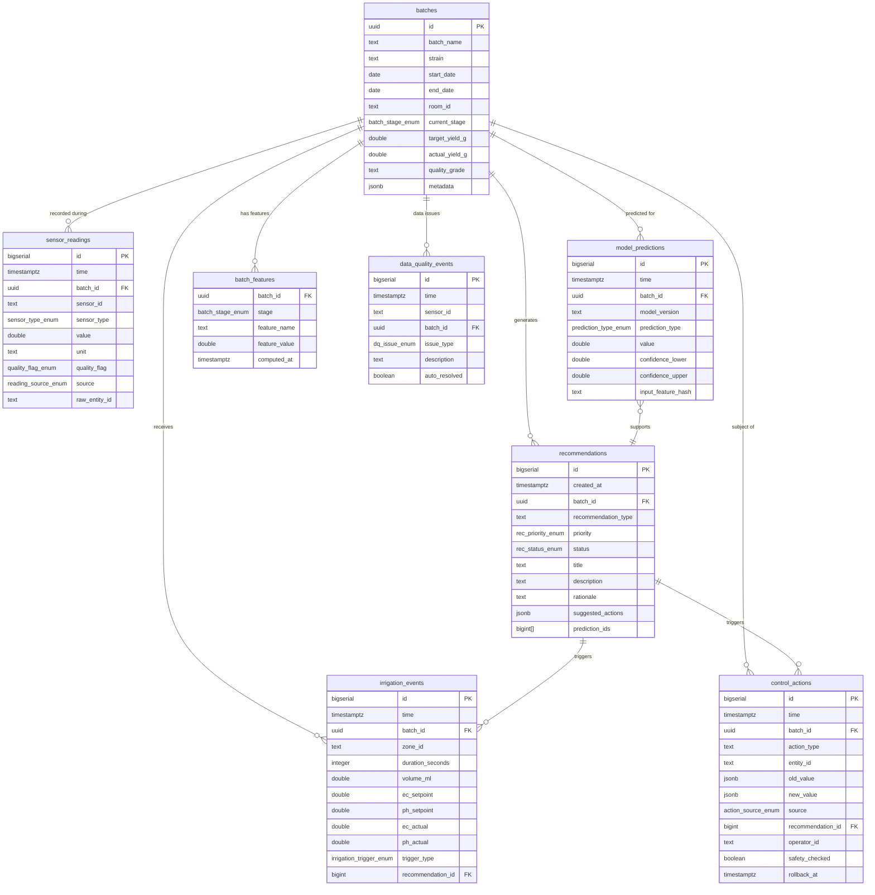

# Data Model Documentation

**Project**: Cultivation Intelligence
**Facility**: Legacy Ag Limited — Indoor Medicinal Cannabis, New Zealand
**Database**: TimescaleDB (PostgreSQL extension)
**Last Updated**: 2026-03-25

---

## Table of Contents

1. [Design Principles](#design-principles)
2. [TimescaleDB Rationale](#timescaledb-rationale)
3. [Core Tables](#core-tables)
4. [TimescaleDB-Specific Configuration](#timescaledb-specific-configuration)
5. [Entity Relationship Diagram](#entity-relationship-diagram)
6. [Index Strategy](#index-strategy)
7. [Data Lifecycle](#data-lifecycle)
8. [Data Quality Flags](#data-quality-flags)
9. [Enumeration Reference](#enumeration-reference)

---

## Design Principles

### Time-Series First

Every measurement in a cultivation environment is a function of time. Temperature at 14:00 is meaningless without knowing it occurred on day 32 of a mid-flower stage. The schema is built to treat time as a first-class dimension, not an incidental column. All sensor data is stored in append-only hypertables that partition data automatically by time chunk. Queries are expected to be anchored on time ranges, and all indexes reflect this assumption.

This is not a transactional OLTP system. Rows are never updated once written (with the exception of quality flag corrections, which are handled via a separate audit mechanism rather than in-place mutation). The canonical rule is: **if a reading was wrong, record a corrected reading with a note, do not modify the original.**

### Append-Only Architecture

The append-only constraint provides several operational advantages:

- Audit compliance: regulators in the NZ medicinal cannabis space require full traceability of cultivation conditions. An immutable log satisfies this requirement without additional audit tables.
- Replayability: the entire state of any batch at any point in time can be reconstructed by replaying events up to that timestamp.
- Simplified replication: append-only tables replicate trivially; there are no update conflicts.
- Compression-friendliness: TimescaleDB's columnar compression achieves 90%+ ratios on append-only time-series data.

Where corrections are needed, they follow this pattern:

```sql
-- Never do this:
UPDATE sensor_readings SET value = 22.1 WHERE id = 'xxx';

-- Do this instead:
INSERT INTO sensor_readings (time, sensor_id, sensor_type, value, quality_flag, source, raw_entity_id)
VALUES (now(), 'sensor_abc', 'TEMPERATURE', 22.1, 'OK', 'MANUAL_CORRECTION', 'sensor.room1_temp');

INSERT INTO data_quality_events (time, sensor_id, issue_type, description, auto_resolved)
VALUES (now(), 'sensor_abc', 'OUT_OF_RANGE', 'Original reading of 45.2°C was probe fault. Corrected to 22.1°C.', false);
```

### Event-Sourced Control Actions

Control actions (actuating climate equipment, triggering dosing) are stored as events, not state. The current state of any controllable entity is the result of replaying all control actions. This means:

- Every change has a reason (recommendation_id, operator_id, or SYSTEM_AUTO source)
- Rollback is explicit — a rollback action is written as a new event
- Full audit trail is trivially available without join complexity

---

## TimescaleDB Rationale

### Why TimescaleDB over Plain PostgreSQL

A plain PostgreSQL table with a timestamp column will degrade significantly as sensor data accumulates. At 60-second polling intervals across 20 sensors, Legacy Ag generates approximately 1,728,000 rows per day. Over a 2-year raw retention window, that is approximately 1.26 billion rows. Sequential scans on an unpartitioned table of this size are not operationally viable.

TimescaleDB solves this through automatic time-based partitioning (hypertables) while preserving the full PostgreSQL interface — existing tools (psql, pg_dump, SQLAlchemy, Alembic) work without modification.

### Hypertables

A hypertable is a PostgreSQL table that TimescaleDB partitions into time-ordered "chunks" under the hood. Each chunk is an independent heap file with its own indexes. This means:

- Queries bounded by a recent time range touch only a small number of chunks
- Old chunks can be independently compressed without locking recent data
- Old chunks can be moved to cheaper storage tiers (via tiered storage or tablespaces)

```sql
-- Convert sensor_readings to a hypertable, partitioned by 1-week chunks
SELECT create_hypertable('sensor_readings', 'time', chunk_time_interval => INTERVAL '1 week');
```

### Continuous Aggregates

Continuous aggregates are materialized views that TimescaleDB keeps incrementally up to date. Rather than scanning all raw data to compute hourly averages, the aggregate is maintained as new data arrives. This makes dashboard queries (e.g., "show me hourly average VPD for the last 30 days") sub-second even at scale.

### Compression

TimescaleDB's columnar compression converts chunks older than a configurable threshold into a compressed columnar format. For sensor readings — which have high temporal locality and low cardinality on the sensor_type column — compression ratios of 20x are common, reducing a 2-year raw dataset from ~500 GB to ~25 GB.

---

## Core Tables

### 1. sensor_readings (Hypertable)

This is the highest-volume table. Every sensor measurement from every source ends up here.

```sql
CREATE TABLE sensor_readings (
    id              BIGSERIAL,
    time            TIMESTAMPTZ     NOT NULL,
    batch_id        UUID            REFERENCES batches(id),
    sensor_id       TEXT            NOT NULL,
    sensor_type     sensor_type_enum NOT NULL,
    value           DOUBLE PRECISION NOT NULL,
    unit            TEXT            NOT NULL,
    quality_flag    quality_flag_enum NOT NULL DEFAULT 'OK',
    source          reading_source_enum NOT NULL,
    raw_entity_id   TEXT,           -- e.g. 'sensor.room1_temperature'
    PRIMARY KEY (id, time)
);

SELECT create_hypertable('sensor_readings', 'time', chunk_time_interval => INTERVAL '1 week');
```

**Column Notes:**

- `time`: Always stored as `TIMESTAMPTZ` (UTC internally). Home Assistant pushes timestamps in ISO 8601; these are parsed and stored as UTC. Never store local time without timezone offset.
- `batch_id`: Nullable. Some readings (e.g., facility-wide CO2) are not associated with a specific batch. The application layer resolves batch association based on room_id and active batch at read time.
- `sensor_id`: A stable identifier for the physical sensor (e.g., `zigbee_room1_rh_01`). Not the HA entity ID, which can change. The mapping is maintained in a `sensor_registry` lookup table (not a hypertable).
- `sensor_type`: Enumerated. Prevents ad-hoc string values from proliferating.
- `value`: Always stored as a double in SI units or the agreed unit for that type (°C for temperature, % for humidity, mS/cm for EC, etc.).
- `unit`: Stored explicitly to catch unit conversion errors at ingest time.
- `quality_flag`: Set at ingest by the data quality pipeline. Can be retrospectively updated via a data quality event.
- `source`: Tracks where the reading came from. Critical for debugging data quality issues — HA_POLL readings are more likely to have gaps than HA_PUSH (WebSocket state_changed events).
- `raw_entity_id`: The original Home Assistant entity ID. Stored for traceability and re-mapping if sensor IDs change.

---

### 2. batches

Each row represents one cultivation batch — from clone/seed to harvest. This is the central organizing entity of the data model.

```sql
CREATE TABLE batches (
    id                  UUID            PRIMARY KEY DEFAULT gen_random_uuid(),
    batch_name          TEXT            NOT NULL UNIQUE,   -- e.g. 'NZ-2026-B14'
    strain              TEXT            NOT NULL,
    start_date          DATE            NOT NULL,
    end_date            DATE,                              -- NULL until harvest
    room_id             TEXT            NOT NULL,          -- e.g. 'flower_room_1'
    current_stage       batch_stage_enum NOT NULL DEFAULT 'PROPAGATION',
    target_yield_g      DOUBLE PRECISION,
    actual_yield_g      DOUBLE PRECISION,                  -- NULL until harvest
    quality_grade       TEXT,                              -- NULL until QA complete
    notes               TEXT,
    metadata            JSONB           NOT NULL DEFAULT '{}',
    created_at          TIMESTAMPTZ     NOT NULL DEFAULT now(),
    updated_at          TIMESTAMPTZ     NOT NULL DEFAULT now()
);
```

**Metadata JSONB Schema (by convention):**

```json
{
  "clone_source": "mother_plant_id_or_supplier",
  "clone_count": 120,
  "medium": "rockwool_slabs",
  "training_method": "LST",
  "lighting_type": "LED",
  "lighting_wattage_per_m2": 400,
  "irrigated_zones": ["zone_1", "zone_2"],
  "aquapro_device": "AQU1AD04A42"
}
```

The `metadata` field intentionally uses JSONB for properties that vary by batch or are added over time, avoiding repeated schema migrations for new batch attributes. However, properties that are queried frequently (strain, room_id) are first-class columns.

**Stage Transitions:**

Stage changes are recorded by updating `current_stage`. An audit trigger writes every stage change to the `control_actions` table with `action_type = 'STAGE_TRANSITION'`. This means the full stage history of a batch is recoverable from `control_actions` even though `batches` only shows the current stage.

---

### 3. irrigation_events

Records every irrigation shot delivered to a zone. Each event represents a single irrigation cycle.

```sql
CREATE TABLE irrigation_events (
    id                  BIGSERIAL       PRIMARY KEY,
    time                TIMESTAMPTZ     NOT NULL,
    batch_id            UUID            NOT NULL REFERENCES batches(id),
    zone_id             TEXT            NOT NULL,
    duration_seconds    INTEGER         NOT NULL CHECK (duration_seconds > 0),
    volume_ml           DOUBLE PRECISION,                  -- NULL if not metered
    ec_setpoint         DOUBLE PRECISION,                  -- mS/cm target
    ph_setpoint         DOUBLE PRECISION,                  -- pH target
    ec_actual           DOUBLE PRECISION,                  -- measured at delivery
    ph_actual           DOUBLE PRECISION,                  -- measured at delivery
    trigger_type        irrigation_trigger_enum NOT NULL,
    recommendation_id   BIGINT          REFERENCES recommendations(id),
    notes               TEXT
);

CREATE INDEX ON irrigation_events (batch_id, time DESC);
CREATE INDEX ON irrigation_events (time DESC);
```

**EC/pH Actuals vs Setpoints:**

The AquaPro dosing unit (serial AQU1AD04A42) reports both target and measured EC/pH via Home Assistant entities. Storing both enables a key derived feature: EC deviation at delivery, which is one of the stronger predictors of root zone stress.

**Trigger Types:**

- `MANUAL`: Operator pressed a button or used a timer
- `SCHEDULED`: A pre-programmed time-based schedule fired
- `ML_RECOMMENDED`: The system generated a recommendation that the operator accepted and executed

---

### 4. control_actions

Append-only event log of every control action taken on any actuatable entity. This is the system of record for all changes made to the facility's controllable parameters.

```sql
CREATE TABLE control_actions (
    id                  BIGSERIAL       PRIMARY KEY,
    time                TIMESTAMPTZ     NOT NULL DEFAULT now(),
    batch_id            UUID            REFERENCES batches(id),
    action_type         TEXT            NOT NULL,
    entity_id           TEXT            NOT NULL,          -- HA entity being controlled
    old_value           JSONB,
    new_value           JSONB           NOT NULL,
    source              action_source_enum NOT NULL,
    recommendation_id   BIGINT          REFERENCES recommendations(id),
    operator_id         TEXT,                              -- NULL if SYSTEM_AUTO
    safety_checked      BOOLEAN         NOT NULL DEFAULT false,
    safety_check_result JSONB,                             -- details from constraint checker
    rollback_at         TIMESTAMPTZ,                       -- when auto-rollback fires
    rolled_back_by      BIGINT          REFERENCES control_actions(id),
    notes               TEXT
);

CREATE INDEX ON control_actions (batch_id, time DESC);
CREATE INDEX ON control_actions (time DESC);
CREATE INDEX ON control_actions (recommendation_id) WHERE recommendation_id IS NOT NULL;
```

**Action Types (by convention, not enumerated to allow extensibility):**

- `EC_ADJUST` — AquaPro EC setpoint change
- `PH_ADJUST` — AquaPro pH setpoint change
- `IRRIGATION_TRIGGER` — Manual or system-initiated irrigation shot
- `CLIMATE_SETPOINT` — HA climate entity temperature/humidity target change
- `LIGHTING_SCHEDULE` — Light on/off time change
- `STAGE_TRANSITION` — Batch moved to next growth stage
- `PUMP_ENABLE` / `PUMP_DISABLE` — Dosing pump state changes
- `SYSTEM_ADVISORY_SENT` — Advisory recommendation delivered to operator (no actuation)

**Rollback Mechanism:**

When `source = 'SYSTEM_AUTO'`, the control engine sets `rollback_at = now() + INTERVAL '15 minutes'`. A background worker checks for past-due rollback timestamps. If the worker detects sensor anomalies post-action (via the data quality pipeline), it executes the rollback immediately and clears `rollback_at`. Rollback creates a new `control_actions` row with `rolled_back_by` pointing to the original action.

---

### 5. batch_features (Materialized Cache)

Pre-computed feature vectors used as model inputs. Computing all features at query time is expensive; this table caches them.

```sql
CREATE TABLE batch_features (
    batch_id        UUID            NOT NULL REFERENCES batches(id),
    stage           batch_stage_enum NOT NULL,
    feature_name    TEXT            NOT NULL,
    feature_value   DOUBLE PRECISION,
    computed_at     TIMESTAMPTZ     NOT NULL DEFAULT now(),
    window_start    TIMESTAMPTZ,
    window_end      TIMESTAMPTZ,
    PRIMARY KEY (batch_id, stage, feature_name, computed_at)
);

CREATE INDEX ON batch_features (batch_id, feature_name, computed_at DESC);
```

Features are recomputed on a schedule (every 15 minutes for rolling features, at stage transition for stage-level features). The `computed_at` column allows retrieval of the feature value as it stood at any point in time — useful for explaining what the model "saw" when it made a historical prediction.

---

### 6. model_predictions

Every model inference result is logged here, whether acted upon or not.

```sql
CREATE TABLE model_predictions (
    id                  BIGSERIAL       PRIMARY KEY,
    time                TIMESTAMPTZ     NOT NULL DEFAULT now(),
    batch_id            UUID            NOT NULL REFERENCES batches(id),
    model_version       TEXT            NOT NULL,          -- e.g. '2.1.0'
    prediction_type     prediction_type_enum NOT NULL,
    value               DOUBLE PRECISION NOT NULL,
    confidence_lower    DOUBLE PRECISION,                  -- q10
    confidence_upper    DOUBLE PRECISION,                  -- q90
    input_feature_hash  TEXT            NOT NULL,          -- SHA256 of input feature dict
    model_artifact_uri  TEXT,                              -- MLflow artifact URI
    inference_latency_ms INTEGER
);

CREATE INDEX ON model_predictions (batch_id, prediction_type, time DESC);
```

**Input Feature Hash:**

The `input_feature_hash` is a SHA-256 hash of the serialized feature dict used as model input. This allows exact reconstruction of the model's input for any historical prediction, supporting auditability and debugging. The actual feature values are retrievable from `batch_features` by joining on `batch_id` and matching `computed_at <= model_predictions.time`.

---

### 7. recommendations

Recommendations are the primary output of the intelligence system. A recommendation bundles one or more model predictions into an actionable suggestion for the operator.

```sql
CREATE TABLE recommendations (
    id                  BIGSERIAL       PRIMARY KEY,
    created_at          TIMESTAMPTZ     NOT NULL DEFAULT now(),
    batch_id            UUID            NOT NULL REFERENCES batches(id),
    recommendation_type TEXT            NOT NULL,
    priority            rec_priority_enum NOT NULL,
    status              rec_status_enum NOT NULL DEFAULT 'PENDING',
    title               TEXT            NOT NULL,
    description         TEXT            NOT NULL,
    rationale           TEXT            NOT NULL,          -- human-readable explanation
    suggested_actions   JSONB           NOT NULL,          -- structured action list
    prediction_ids      BIGINT[]        NOT NULL DEFAULT '{}',
    operator_id_reviewed TEXT,
    reviewed_at         TIMESTAMPTZ,
    outcome_notes       TEXT,
    expires_at          TIMESTAMPTZ     NOT NULL           -- recommendations auto-expire
);

CREATE INDEX ON recommendations (batch_id, status, created_at DESC);
CREATE INDEX ON recommendations (status, created_at DESC);
```

**Suggested Actions JSONB Schema:**

```json
{
  "actions": [
    {
      "action_type": "EC_ADJUST",
      "entity_id": "number.aquapro_aq1ad04a42_ec_setpoint",
      "target_value": 2.1,
      "current_value": 1.8,
      "rationale": "EC 0.3 below target for 18h. Mid-flower uptake demand is elevated."
    }
  ]
}
```

**Recommendation Priority Levels:**

- `CRITICAL` — Immediate action required. Sensor reading out of safe range. SLA: alert operator within 60 seconds.
- `HIGH` — Action recommended within 4 hours. Trending toward out-of-range.
- `MEDIUM` — Optimization opportunity. Act within 24 hours.
- `LOW` — Informational. No urgency.

---

### 8. data_quality_events

Tracks detected data quality issues at the sensor level.

```sql
CREATE TABLE data_quality_events (
    id              BIGSERIAL       PRIMARY KEY,
    time            TIMESTAMPTZ     NOT NULL DEFAULT now(),
    sensor_id       TEXT            NOT NULL,
    batch_id        UUID            REFERENCES batches(id),
    issue_type      dq_issue_enum   NOT NULL,
    description     TEXT            NOT NULL,
    affected_start  TIMESTAMPTZ,
    affected_end    TIMESTAMPTZ,
    auto_resolved   BOOLEAN         NOT NULL DEFAULT false,
    resolved_at     TIMESTAMPTZ,
    resolved_by     TEXT,
    resolution_notes TEXT
);

CREATE INDEX ON data_quality_events (sensor_id, time DESC);
CREATE INDEX ON data_quality_events (time DESC) WHERE auto_resolved = false;
```

---

## TimescaleDB-Specific Configuration

### Chunk Time Intervals

```sql
-- sensor_readings: 1-week chunks. At ~250k rows/day, this yields ~1.75M rows per chunk.
-- Manageable chunk size for compression and index performance.
SELECT set_chunk_time_interval('sensor_readings', INTERVAL '1 week');
```

### Continuous Aggregates

```sql
-- Hourly rollup: used for dashboard queries and feature engineering (1h mean, 1h std)
CREATE MATERIALIZED VIEW sensor_readings_hourly
WITH (timescaledb.continuous) AS
SELECT
    time_bucket('1 hour', time)    AS bucket,
    batch_id,
    sensor_id,
    sensor_type,
    AVG(value)                     AS mean_value,
    STDDEV(value)                  AS std_value,
    MIN(value)                     AS min_value,
    MAX(value)                     AS max_value,
    COUNT(*)                       AS sample_count,
    COUNT(*) FILTER (WHERE quality_flag = 'OK') AS ok_count
FROM sensor_readings
WHERE quality_flag != 'INVALID'
GROUP BY bucket, batch_id, sensor_id, sensor_type
WITH NO DATA;

SELECT add_continuous_aggregate_policy('sensor_readings_hourly',
    start_offset => INTERVAL '3 hours',
    end_offset   => INTERVAL '1 hour',
    schedule_interval => INTERVAL '1 hour'
);

-- Daily rollup: used for DLI accumulation, trend analysis
CREATE MATERIALIZED VIEW sensor_readings_daily
WITH (timescaledb.continuous) AS
SELECT
    time_bucket('1 day', time)     AS bucket,
    batch_id,
    sensor_id,
    sensor_type,
    AVG(value)                     AS mean_value,
    STDDEV(value)                  AS std_value,
    MIN(value)                     AS min_value,
    MAX(value)                     AS max_value,
    COUNT(*)                       AS sample_count,
    SUM(value) FILTER (WHERE sensor_type = 'PPFD') AS ppfd_sum  -- for DLI
FROM sensor_readings
WHERE quality_flag != 'INVALID'
GROUP BY bucket, batch_id, sensor_id, sensor_type
WITH NO DATA;
```

### Compression Policies

```sql
-- Compress chunks older than 30 days
SELECT add_compression_policy('sensor_readings', compress_after => INTERVAL '30 days');

-- Compression settings: segment by sensor_id for better columnar compression
ALTER TABLE sensor_readings SET (
    timescaledb.compress,
    timescaledb.compress_segmentby = 'sensor_id, sensor_type',
    timescaledb.compress_orderby = 'time DESC'
);
```

### Retention Policies

```sql
-- Raw sensor readings: 2 years
SELECT add_retention_policy('sensor_readings', drop_after => INTERVAL '2 years');

-- Hourly aggregates: 5 years
SELECT add_retention_policy('sensor_readings_hourly', drop_after => INTERVAL '5 years');

-- Daily aggregates: 10 years (regulatory compliance)
SELECT add_retention_policy('sensor_readings_daily', drop_after => INTERVAL '10 years');
```

---

## Entity Relationship Diagram



---

## Index Strategy

### Primary Query Patterns

The application issues four dominant query shapes:

**Pattern 1: Time-range sensor reads for a specific batch (dashboards, feature engineering)**

```sql
SELECT time, sensor_type, value, quality_flag
FROM sensor_readings
WHERE batch_id = $1
  AND sensor_type = $2
  AND time >= $3
  AND time < $4
ORDER BY time DESC;
```

Index:
```sql
CREATE INDEX idx_sr_batch_type_time ON sensor_readings (batch_id, sensor_type, time DESC)
    WITH (timescaledb.transaction_per_chunk);
```

**Pattern 2: Latest reading per sensor (real-time monitoring dashboard)**

```sql
SELECT DISTINCT ON (sensor_id) sensor_id, time, value, quality_flag
FROM sensor_readings
WHERE time > now() - INTERVAL '5 minutes'
ORDER BY sensor_id, time DESC;
```

Index:
```sql
CREATE INDEX idx_sr_sensor_time ON sensor_readings (sensor_id, time DESC)
    WITH (timescaledb.transaction_per_chunk);
```

**Pattern 3: Open recommendations for operator dashboard**

```sql
SELECT * FROM recommendations
WHERE batch_id = $1 AND status = 'PENDING'
ORDER BY priority DESC, created_at ASC;
```

Index (already defined above):
```sql
CREATE INDEX ON recommendations (batch_id, status, created_at DESC);
```

**Pattern 4: Control action audit trail**

```sql
SELECT * FROM control_actions
WHERE batch_id = $1
ORDER BY time DESC
LIMIT 100;
```

Index (already defined above).

---

## Data Lifecycle

| Data Type               | Raw Retention | Aggregate Retention | Notes                              |
|-------------------------|---------------|---------------------|------------------------------------|
| sensor_readings         | 2 years       | N/A (see below)     | Compressed after 30 days           |
| sensor_readings_hourly  | 5 years       | Continuous          | Used for dashboard, feature eng.   |
| sensor_readings_daily   | 10 years      | Continuous          | Regulatory compliance              |
| irrigation_events       | 10 years      | N/A                 | Full lifecycle retained            |
| control_actions         | 10 years      | N/A                 | Audit log, never deleted           |
| recommendations         | 5 years       | N/A                 | Outcome tracking                   |
| model_predictions       | 3 years       | N/A                 | For model auditing                 |
| batch_features          | 2 years       | N/A                 | Recomputed; historical for audit   |
| data_quality_events     | 5 years       | N/A                 | Quality trend analysis             |

Retention policies are enforced by TimescaleDB's `add_retention_policy()`. The drop operation is on the chunk level — it is immediate and does not require a vacuum pass.

---

## Data Quality Flags

Every `sensor_readings` row carries a `quality_flag`. The flag is set at ingest time by the data quality pipeline and may be updated retrospectively via `data_quality_events`.

| Flag      | Meaning                                                                              | Model Usage                        |
|-----------|--------------------------------------------------------------------------------------|------------------------------------|
| `OK`      | Reading passed all quality checks                                                   | Included in all calculations       |
| `SUSPECT` | Reading is plausible but triggered a soft-threshold check (e.g., rapid step change) | Included but down-weighted         |
| `INVALID` | Reading is physically implausible or sensor confirmed offline                        | Excluded from all model inputs     |

**Automatic Flag Assignment Rules:**

- **SPIKE detection**: if `|value - rolling_median_5| > 3 * rolling_iqr_5`, flag as `SUSPECT`. If `|value - rolling_median_5| > 6 * rolling_iqr_5`, flag as `INVALID`.
- **FLATLINE detection**: if `STDDEV(last_20_readings) < 0.001`, flag all as `SUSPECT` (sensor may be stuck).
- **OUT_OF_RANGE**: hard physical limits per sensor type (see enumeration reference). Readings outside these are flagged `INVALID`.
- **MISSING**: gaps > 5 minutes are recorded in `data_quality_events`. No row is inserted; the absence of rows is the signal.

---

## Enumeration Reference

```sql
CREATE TYPE sensor_type_enum AS ENUM (
    'TEMPERATURE',    -- °C, ambient air
    'HUMIDITY',       -- %, relative humidity
    'VPD',           -- kPa, vapour pressure deficit (derived)
    'EC',            -- mS/cm, electrical conductivity
    'PH',            -- pH units
    'VWC',           -- %, volumetric water content
    'CO2',           -- ppm
    'PPFD',          -- µmol/m²/s, photosynthetic photon flux density
    'FLOW_RATE'      -- L/min
);

CREATE TYPE quality_flag_enum AS ENUM ('OK', 'SUSPECT', 'INVALID');

CREATE TYPE reading_source_enum AS ENUM (
    'HA_PUSH',          -- Home Assistant WebSocket state_changed event
    'HA_POLL',          -- Home Assistant REST API poll
    'CSV_IMPORT',       -- Historical data imported from CSV
    'MANUAL_CORRECTION' -- Operator-entered correction
);

CREATE TYPE batch_stage_enum AS ENUM (
    'PROPAGATION', 'VEG', 'EARLY_FLOWER', 'MID_FLOWER',
    'LATE_FLOWER', 'FLUSH', 'HARVEST', 'COMPLETE'
);

CREATE TYPE irrigation_trigger_enum AS ENUM ('MANUAL', 'SCHEDULED', 'ML_RECOMMENDED');

CREATE TYPE action_source_enum AS ENUM ('OPERATOR', 'SYSTEM_ADVISORY', 'SYSTEM_AUTO');

CREATE TYPE prediction_type_enum AS ENUM (
    'YIELD_ESTIMATE', 'QUALITY_SCORE', 'RISK_SCORE', 'STAGE_COMPLETION'
);

CREATE TYPE rec_priority_enum AS ENUM ('CRITICAL', 'HIGH', 'MEDIUM', 'LOW');

CREATE TYPE rec_status_enum AS ENUM ('PENDING', 'ACCEPTED', 'REJECTED', 'EXPIRED');

CREATE TYPE dq_issue_enum AS ENUM (
    'SPIKE', 'FLATLINE', 'MISSING', 'OUT_OF_RANGE', 'SENSOR_OFFLINE'
);
```

**Physical Limits for OUT_OF_RANGE Detection:**

| Sensor Type | Absolute Min | Absolute Max | Unit     |
|-------------|-------------|-------------|----------|
| TEMPERATURE | 0.0         | 50.0        | °C       |
| HUMIDITY    | 0.0         | 100.0       | %        |
| VPD         | 0.0         | 5.0         | kPa      |
| EC          | 0.0         | 6.0         | mS/cm    |
| PH          | 3.0         | 9.0         | pH       |
| VWC         | 0.0         | 100.0       | %        |
| CO2         | 200.0       | 5000.0      | ppm      |
| PPFD        | 0.0         | 2500.0      | µmol/m²/s|
| FLOW_RATE   | 0.0         | 50.0        | L/min    |
