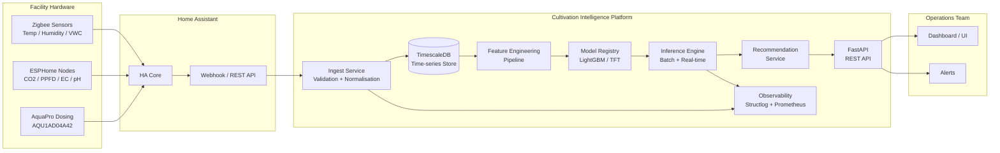

# Cultivation Intelligence

**Precision grow analytics and decision support for Legacy Ag Limited**

[](https://github.com/legacy-ag/cultivation-intelligence/actions)
[](https://cultivation-intelligence.readthedocs.io)
[](https://cultivation-intelligence.readthedocs.io/coverage)
[](./architecture.md)
[](../LICENSE)

---

## What Is This System?

Cultivation Intelligence is an internal analytics and decision-support platform built for Legacy Ag Limited's indoor medicinal cannabis facility in New Zealand. It collects, stores, and processes environmental and nutrient sensor data from the existing Home Assistant / ESPHome / Zigbee sensor network and AquaPro dosing unit (serial AQU1AD04A42), then uses machine learning models to surface actionable recommendations to the operations team.

The system is deliberately designed in an **advisory-first** mode: all recommendations are surfaced to human operators who make the final call. It does not write back to actuators in v1. Its goal is to reduce reactive decision-making, capture institutional knowledge in a reproducible form, and provide the facility with a measurable, data-driven foundation for continuous improvement across grow batches.

The platform is built entirely on open-source components — FastAPI, TimescaleDB, Redis, scikit-learn, LightGBM, and SHAP — with no external SaaS licensing fees. It runs on-premises to satisfy NZ data residency requirements and integrates with the existing Home Assistant installation via its REST and WebSocket APIs.

---

## High-Level Data Flow



---

## Current Phase

!!! info "Phase 0 — Data Ingestion and Feature Engineering"
    The system is currently in **Phase 0**. The ingestion pipeline is live, reading sensor telemetry from Home Assistant into TimescaleDB. The feature engineering pipeline is under active development. No production models are deployed yet.

    **What is working:**
    - HA webhook receiver and entity normalisation
    - TimescaleDB hypertable schema for sensor telemetry
    - AquaPro dosing event ingestion (device AQU1AD04A42)
    - Lag, rolling-window, and grow-stage feature derivation (in progress)

    **What is next (Phase 1):**
    - First LightGBM batch outcome model (target: yield index)
    - VPD / DLI recommendation engine
    - Risk scoring dashboard (EC drift, pH excursion, VPD spike)

---

## Getting Started

| You want to... | Go to |
|---|---|
| Understand the system architecture | [Architecture](./architecture.md) |
| Run or operate the system | [Operations Runbook](./ops-runbook.md) |
| Read the executive overview | [Executive Summary](./executive-summary.md) |
| Understand the product specification | [Product Brief](./product-brief.md) |
| Understand the ML theory and modelling decisions | [Theory](./theory.md) |
| Review the API | [API Reference](./api-reference.md) |
| Contribute to the codebase | [Contributing](./contributing.md) |

---

## Navigation

### Core Documentation

- **[Executive Summary](./executive-summary.md)** — Plain English overview for facility owners and managers. No jargon.
- **[Product Brief](./product-brief.md)** — Detailed product specification: personas, user stories, success metrics, MVP scope.
- **[Theory](./theory.md)** — Rigorous ML theory: why LightGBM, when to switch to deep learning, uncertainty quantification, control theory.
- **[Architecture](./architecture.md)** — Full system architecture with C4 diagrams, component breakdown, data flows, deployment, security.

### Operations

- **[Operations Runbook](./ops-runbook.md)** — Day-to-day operational procedures, alert responses, maintenance schedules.
- **[Incident Response](./incident-response.md)** — Playbooks for common failure scenarios.
- **[Data Dictionary](./data-dictionary.md)** — All sensor entities, units, expected ranges, and anomaly thresholds.

### Development

- **[Contributing](./contributing.md)** — Setup, code standards, PR process.
- **[API Reference](./api-reference.md)** — FastAPI endpoint documentation.
- **[Model Card](./model-card.md)** — Model metadata, training data, evaluation results, limitations.
- **[Changelog](./changelog.md)** — Release history.

---

## System at a Glance

| Attribute | Value |
|---|---|
| Facility | Legacy Ag Limited, New Zealand |
| Facility type | Indoor medicinal cannabis (licensed) |
| Sensor backbone | Zigbee / ESPHome via Home Assistant |
| Dosing unit | AquaPro AQU1AD04A42 |
| Primary datastore | TimescaleDB (PostgreSQL extension) |
| ML framework | LightGBM, scikit-learn, SHAP |
| API framework | FastAPI (Python 3.11+) |
| Deployment | Docker Compose (on-premises) |
| Observability | structlog, Prometheus, Grafana |
| Operating mode | Advisory (human-in-the-loop) |
| Data residency | On-premises, NZ |
| Licensing | MIT (all dependencies open source) |

---

## Sensor Streams Monitored

The platform ingests and models the following sensor streams. All readings are normalised to SI units on ingestion.

| Stream | Source | Unit | Cadence |
|---|---|---|---|
| Air temperature | Zigbee / ESPHome | °C | 60 s |
| Relative humidity | Zigbee | % | 60 s |
| VPD (derived) | Computed | kPa | 60 s |
| CO₂ concentration | ESPHome | ppm | 60 s |
| PPFD | ESPHome (PAR sensor) | µmol m⁻² s⁻¹ | 60 s |
| DLI (derived) | Computed daily integral | mol m⁻² d⁻¹ | Daily |
| Substrate VWC | Zigbee | % | 5 min |
| Nutrient solution EC | AquaPro / ESPHome | mS/cm | 5 min |
| Nutrient solution pH | AquaPro / ESPHome | pH units | 5 min |
| Rootzone temperature | ESPHome | °C | 5 min |
| Dosing events | AquaPro AQU1AD04A42 | Event log | On event |

---

## Design Principles

1. **Advisory first.** The system recommends; humans decide. Trust is earned incrementally through demonstrated accuracy before any automation is considered.
2. **Explainability over accuracy.** A recommendation a grower does not understand will not be followed. SHAP values and plain-language explanations accompany every model output.
3. **Open by default.** All components are open source. No vendor lock-in. All data remains on-premises.
4. **Fail safe.** Any failure in the CI platform has zero effect on facility operations. The HA automation layer is entirely independent.
5. **Incrementally deployable.** Each phase delivers standalone value. Phase 0 data collection is useful even if no model is ever deployed.
6. **Auditable.** Every recommendation, every model version, every training run, and every operator decision is logged with a timestamp and retained.

---

## Quick Links

- [GitHub Repository](https://github.com/legacy-ag/cultivation-intelligence) *(internal)*
- [Home Assistant Instance](http://homeassistant.local:8123) *(facility LAN only)*
- [Grafana Dashboard](http://monitoring.local:3000) *(facility LAN only)*
- [TimescaleDB](postgresql://localhost:5432/cultivation) *(internal)*
- [FastAPI Docs](http://localhost:8000/docs) *(local dev)*

---

## Phase Roadmap

The platform is developed in discrete phases, each of which delivers standalone value. No phase is a prerequisite for the facility to continue operating — the system is additive at every stage.

| Phase | Name | Status | Key Deliverables |
|---|---|---|---|
| 0 | Data Foundation | In Progress | HA webhook ingest, TimescaleDB schema, AquaPro event capture, entity normalisation |
| 1 | First Models | Planned (Q3 2026) | LightGBM batch outcome model, VPD/DLI recommendations, risk score dashboard |
| 2 | Continuous Forecasting | Planned (Q1 2027) | Multi-step ahead sensor forecasting (TFT), multi-batch comparison UI, annotation system |
| 3 | Controlled Automation | Aspirational | MPC integration, write-back to HA automations, advanced strain profiling |

Phase boundaries are defined by batch count milestones (which gate model complexity) as much as by calendar time. See [Theory](./theory.md) for the batch-count thresholds that justify each model architecture change.

---

## Technology Stack

The full open-source stack used by the platform, with version targets:

| Component | Technology | Version Target | Role |
|---|---|---|---|
| Language | Python | 3.11+ | All services |
| API framework | FastAPI | 0.110+ | Ingest service, API gateway, recommendation service |
| Data validation | Pydantic v2 | 2.x | Request/response models, config |
| ORM / query | SQLAlchemy | 2.x | Database access layer |
| Migrations | Alembic | 1.x | Schema version control |
| Time-series DB | TimescaleDB | pg15-latest | Primary data store |
| Cache / event bus | Redis | 7.x | Pub/sub, current-state cache |
| ML — tabular | LightGBM | 4.x | Batch outcome model, risk scoring |
| ML — utilities | scikit-learn | 1.4+ | Preprocessing, calibration, cross-validation |
| Explainability | SHAP | 0.44+ | Feature attribution for all predictions |
| Uncertainty | MAPIE | 0.8+ | Conformal prediction intervals |
| Hyperparameter opt | Optuna | 3.x | LightGBM hyperparameter search |
| Data manipulation | pandas | 2.x | Feature engineering pipeline |
| Numerical | NumPy | 1.26+ | Array operations |
| Logging | structlog | 24.x | Structured JSON logging |
| Metrics | prometheus-client | 0.20+ | Prometheus metrics export |
| Containerisation | Docker + Compose | 24+ / v2 | Deployment orchestration |
| Visualisation | Grafana | 10.x | Dashboards (reads TimescaleDB directly) |
| Metrics store | Prometheus | 2.x | Metrics collection |
| Log aggregation | Loki | 3.x | Log aggregation from Docker stdout |
| Alerting | Alertmanager | 0.26+ | Alert routing to operator channels |
| Docs | MkDocs + Material | 9.x | This documentation site |

---

## Repository Structure

```
cultivation-intelligence/
├── services/
│   ├── ingest/              # HA webhook receiver and normaliser
│   ├── feature_engineering/ # Feature pipeline (batch and streaming)
│   ├── training/            # Model training and evaluation
│   ├── inference/           # Model inference engine
│   ├── recommendations/     # Recommendation and risk scoring service
│   └── api/                 # FastAPI REST gateway
├── db/
│   ├── migrations/          # Alembic migration scripts
│   └── schema/              # Base schema SQL files
├── models/                  # Model registry (artefacts + metadata)
├── notebooks/               # Exploratory analysis (not production)
├── tests/                   # Unit and integration tests
├── monitoring/
│   ├── prometheus/          # Scrape configs and alert rules
│   ├── grafana/             # Dashboard JSON exports
│   └── loki/                # Log aggregation config
├── docs/                    # This documentation (MkDocs source)
├── docker-compose.yml       # Full stack definition
├── docker-compose.prod.yml  # Production overrides
├── .env.example             # Environment variable template
└── pyproject.toml           # Python project config (uv / pip)
```

---

## Contributing

All platform development is conducted by the Legacy Ag internal technical team. The codebase follows standard Python conventions enforced by `ruff` (linting) and `mypy` (type checking). Tests are written with `pytest`. Pre-commit hooks enforce formatting and type checks before any commit lands.

See [Contributing](./contributing.md) for the full development setup guide, branch naming conventions, PR review process, and deployment checklist.

---

*Documentation built with [MkDocs](https://www.mkdocs.org/) and the [Material theme](https://squidfunk.github.io/mkdocs-material/). Last updated: 2026-03-25.*
